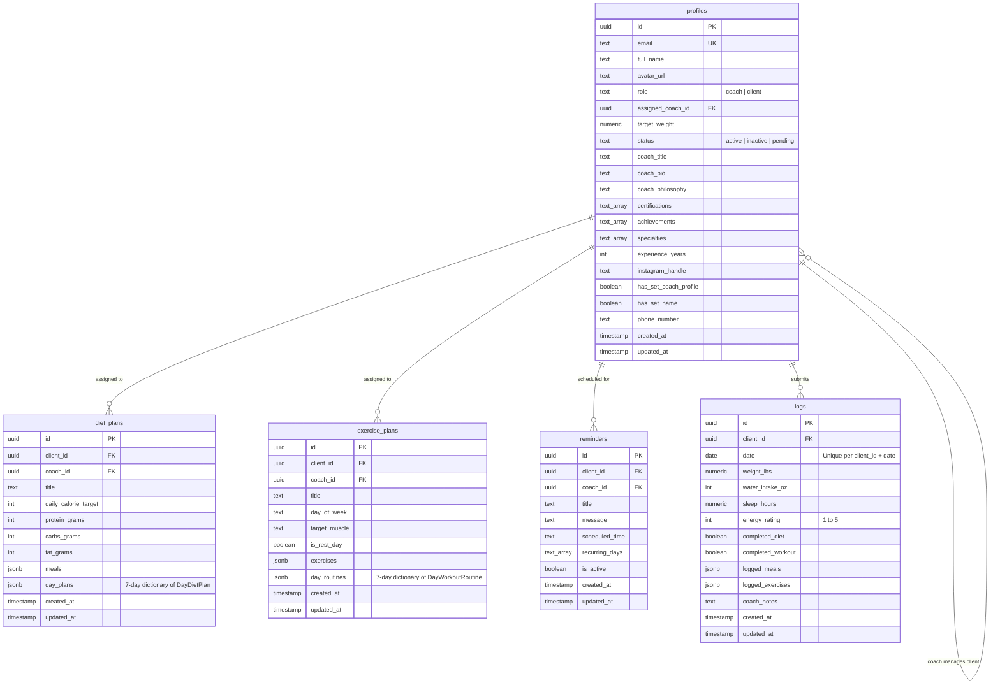

# FitTrack Pro — System Architecture & Technical Context

> **Target Audience**: AI IDEs (Antigravity, Cursor, Windsurf, Copilot, Roo Code, Claude Code), autonomous agents, and software engineers onboarding to the FitTrack Pro repository.

---

## 1. Executive Summary & App Purpose

**FitTrack Pro** is a modern, high-performance **1-on-1 Fitness Coaching & Performance Tracking application** built with **React Native (Expo SDK 54)**. It targets both **Android Native** (APK / Google Play App Bundle) and **Progressive Web App (PWA)** environments from a unified, cross-platform TypeScript codebase.

### Core Mission & Problems Solved
Traditional independent fitness coaching suffers from fragmented workflows—coaches juggle spreadsheets, WhatsApp messages, generic PDF workout routines, and manual check-in reminders. FitTrack Pro solves this by delivering an integrated, bilateral platform:
1. **Coach Administration (Single Coach Model)**: A dedicated head coach manages an active athlete roster, assigns customized 7-day nutrition/diet plans, configures 7-day progressive workout routines (sets, reps, weights, rest intervals, target muscle groups), sets automated recurring reminders, and reviews daily athlete metrics with coach feedback notes.
2. **Athlete / Client Interface**: Athletes authenticate, track daily meal completion against exact macro goals (Calories, Protein, Carbs, Fats), record workouts set-by-set with an integrated rest timer, log essential daily health metrics (Morning Weight, Water Intake in oz, Sleep Hours, Energy Rating from 1 to 5), and review historical compliance trends.
3. **Continuous Accountability**: Eliminates guesswork through real-time synchronization, streak tracking, workout completion rates, and direct coach-to-client feedback.

---

## 2. High-Level System Architecture

```
                                  +---------------------------------------+
                                  |            Client Platform            |
                                  |  - Android Native (APK / AAB via EAS) |
                                  |  - Desktop Web & PWA (Installable)    |
                                  +-------------------+-------------------+
                                                      |
                                                      v
                                        +---------------------------+
                                        |    Expo SDK 54 Runtime    |
                                        |   React Native 0.81.5     |
                                        |      React 19.1.0         |
                                        +-------------+-------------+
                                                      |
                     +--------------------------------+--------------------------------+
                     |                                                                 |
                     v                                                                 v
+------------------------------------------+                      +------------------------------------------+
|          Global State (Zustand)          |                      |        Server State (React Query)        |
|  - Auth user & session state             |                      |  - useClients / useProfile               |
|  - Active navigation tabs & selection    |                      |  - useDietPlan / useAllDietPlans         |
|  - Rest timer & modal triggers           |                      |  - useExercisePlan / useAllExercisePlans |
|  - Theme mode (Dark / Light)             |                      |  - useLog / useLogs / useClientStats     |
+--------------------+---------------------+                      +--------------------+---------------------+
                     |                                                                 |
                     +--------------------------------+--------------------------------+
                                                      |
                                                      v
                                        +---------------------------+
                                        |     Supabase Service      |
                                        |   - Supabase Auth (OAuth) |
                                        |   - PostgreSQL Database   |
                                        |   - Row Level Security    |
                                        +---------------------------+
```

### Technology Stack Summary

| Layer | Technology | Version / Specification | Role in Application |
|---|---|---|---|
| **Mobile Runtime** | React Native / Expo | Expo SDK `~54.0.36`, RN `0.81.5`, React `19.1.0` | Cross-platform core with New Architecture enabled (`newArchEnabled: true`) |
| **Web Runtime** | `react-native-web` | `^0.21.0` via Metro Bundler | Compiles React Native primitives to semantic DOM elements |
| **PWA & Offline** | Service Worker + Web Manifest | Standard PWA spec (`public/manifest.json`, `public/sw.js`) | Offline app shell caching, standalone display, Apple touch icons |
| **Backend as a Service** | Supabase | `@supabase/supabase-js ^2.110.8` | Cloud PostgreSQL, Google OAuth authentication, Row Level Security (RLS) |
| **Client State** | Zustand | `^5.0.14` (`app/lib/store.ts`) | Synchronous UI state: active tabs, selected client ID, rest timer countdown, modals |
| **Server Cache & Sync** | TanStack React Query | `^5.101.4` (`app/lib/queries/`) | Async queries, cache invalidation, optimistic updates, background refetching |
| **Vector Icons** | Lucide React Native | `^0.546.0` (`lucide-react-native`) | Crisp, SVG-based icon suite for buttons, navigation tabs, and indicators |
| **Typography & Theme** | Custom Design Tokens | `app/theme/theme.ts` | Material Design 3 inspired, 8pt grid, dark mode default with `#C7F000` / `#CCFF00` Electric Lime accents |
| **Type Checking** | TypeScript | `~5.9.2` (`tsconfig.json`) | Strict TypeScript contracts for database schemas, navigation params, and components |

---

## 3. Authentication, Authorization & Security Architecture

### Single-Coach vs. Client Hierarchy
FitTrack Pro implements an asymmetric **Single-Coach, Multi-Athlete** governance model:
1. **Coach Email Configuration**:
   - The head coach is identified by comparing the authenticated user's email with `EXPO_PUBLIC_COACH_EMAIL` (configured in `.env` and evaluated in [`app/config/auth.ts`](file:///app/config/auth.ts) via `isCoachEmail()`).
   - Default/fallback coach email: `muhammadahsan0812@gmail.com`.
2. **Database Trigger Assignment**:
   - In [`schema.sql`](file:///schema.sql), a PostgreSQL trigger `handle_new_user()` executes on `auth.users` insert/update.
   - If `LOWER(NEW.email) = 'muhammadahsan0812@gmail.com'`, it assigns `role = 'coach'`; otherwise, `role = 'client'`.
3. **Database Security (RLS)**:
   - Security is enforced at the PostgreSQL database level using Supabase Row Level Security (RLS). UI route guards are strictly for UX; unauthorized queries fail at the database boundary.
   - The PostgreSQL security function `public.is_coach()` validates whether `auth.uid()` corresponds to the head coach email.
   - **Clients** can only `SELECT`, `INSERT`, or `UPDATE` their own data (`client_id = auth.uid()`).
   - The **Coach** has administrative permissions (`SELECT`, `INSERT`, `UPDATE`, `DELETE`) across all client profiles, plans, reminders, and daily check-in logs.

### Cross-Platform Google OAuth Workflow
Authentication is unified via Google OAuth 2.0 with platform-specific handoffs:
- **Web / PWA**:
  - Initiated in [`app/screens/auth/LoginScreen.tsx`](file:///app/screens/auth/LoginScreen.tsx) with `supabase.auth.signInWithOAuth({ provider: 'google', options: { redirectTo: window.location.origin } })`.
  - Upon return from Google, OAuth tokens/codes in the URL hash/query string are exchanged, followed by a clean URL rewrite via `window.history.replaceState`.
- **Android Native**:
  - Uses `AuthSession.makeRedirectUri({ scheme: 'fittrack' })` and `WebBrowser.openAuthSessionAsync(data.url, redirectUrl)`.
  - Captures the deep-link return (`fittrack://*`) and executes `supabase.auth.exchangeCodeForSession(code)` or `supabase.auth.setSession(...)`.

### Onboarding Guardrail Pipeline
[`app/navigation/RootNavigator.tsx`](file:///app/navigation/RootNavigator.tsx) enforces a strict 4-step progressive disclosure pipeline:
```
[Unauthenticated User] ───────> LoginScreen
           │ (Google OAuth Sign-in)
           v
[Missing Display Name] ───────> DisplayNameScreen (persists to profiles.full_name & user_metadata)
           │
           v
[Missing Phone Number] ───────> PhoneNumberScreen (persists to profiles.phone_number)
           │
           v
   Role Resolution ───────────┬───> CoachNavigator  (isCoachEmail == true)
                              └───> ClientNavigator (isCoachEmail == false)
```

---

## 4. Codebase Directory Map

```
fittrack/
├── App.js                       # Root entry point: QueryClientProvider & SafeAreaProvider
├── app.json                     # Expo SDK configuration (package name, deep link schemes, icons)
├── package.json                 # Dependency definitions and scripts
├── schema.sql                   # Full Supabase PostgreSQL schema, triggers, and RLS policies
├── .env.example                 # Template for required environment variables
├── assets/                      # App icons, splash screens, adaptive icons, and branding art
├── public/                      # Static web assets, manifest.json, sw.js (PWA service worker)
│
└── app/
    ├── components/              # Reusable UI widgets and dialog modals
    │   ├── CoachProfileModal.tsx    # Detailed modal showing coach bio, achievements & credentials
    │   ├── EditDisplayNameModal.tsx # Modal allowing users to update their profile full name
    │   ├── EditPhoneModal.tsx       # Modal allowing users to update their contact phone number
    │   ├── GoogleIcon.tsx           # Vector SVG Google "G" logo for OAuth button
    │   ├── LogoutConfirmModal.tsx   # Sign-out confirmation dialog
    │   ├── ProfileDropdown.tsx      # Header user badge dropdown (Profile, Theme, Phone, Sign-out)
    │   ├── RestTimerModal.tsx       # Interactive rest interval timer with pause/resume & quick adds
    │   └── SplashScreen.tsx         # Animated branded boot splash with dumbbell reveal
    │
    ├── config/
    │   └── auth.ts              # Head coach email configuration & isCoachEmail() utility
    │
    ├── lib/
    │   ├── supabase.ts          # Supabase client configured with AsyncStorage & auto-refresh
    │   ├── store.ts             # Zustand global store (UIStore: tabs, modals, timer, selection)
    │   └── queries/             # TanStack React Query hooks wrapping Supabase PostgreSQL queries
    │       ├── dietPlans.ts     # useDietPlan, useAllDietPlans, useCreateDietPlan, useUpdateDietPlan
    │       ├── exercisePlans.ts # useExercisePlan, useAllExercisePlans, useCreateExercisePlan, etc.
    │       ├── logs.ts          # useLog (today), useLogs (history), useUpdateLog
    │       ├── profiles.ts      # useClients, useProfile, useClientStats, useHeadCoachProfile
    │       └── reminders.ts     # useReminders, useCreateReminder, useUpdateReminder, useDeleteReminder
    │
    ├── navigation/
    │   ├── RootNavigator.tsx    # Authentication gatekeeper, OAuth deep link listener & router
    │   ├── CoachNavigator.tsx   # Coach application shell with responsive desktop header & bottom tabs
    │   └── ClientNavigator.tsx  # Athlete application shell with responsive desktop header & bottom tabs
    │
    ├── screens/
    │   ├── auth/                # Authentication & user onboarding screens
    │   │   ├── LoginScreen.tsx        # High-impact branded landing page with Google OAuth
    │   │   ├── DisplayNameScreen.tsx  # Name capture & confirmation step
    │   │   └── PhoneNumberScreen.tsx  # Phone number capture step with dial code selector
    │   │
    │   ├── client/              # Athlete / Client experience screens
    │   │   ├── HomeScreen.tsx             # Daily summary: today's macros, meal checklist & today's workout
    │   │   ├── DietPlanScreen.tsx         # 7-day interactive diet viewer with macro breakdown & meal toggles
    │   │   ├── ExercisePlanScreen.tsx     # 7-day workout routine with sets/reps logger & rest timer trigger
    │   │   ├── LogEntryScreen.tsx         # Daily check-in: weight, water, sleep, energy rating & coach notes
    │   │   └── ProgressHistoryScreen.tsx  # Visual history of logged check-ins, weight trend & compliance
    │   │
    │   └── coach/               # Coach management dashboard screens
    │       ├── DashboardScreen.tsx        # Athlete roster overview, quick stats, search & filter
    │       ├── ClientDetailScreen.tsx     # Deep dive into an athlete: profile, current plans, logs & notes
    │       ├── DietPlanEditorScreen.tsx   # 7-day diet builder with meal suggestions, calories & macros
    │       ├── ExercisePlanEditorScreen.tsx # 7-day workout builder with exercise library & rest intervals
    │       ├── ReminderEditorScreen.tsx   # Automated recurring reminder builder
    │       └── CoachProfileEditorScreen.tsx # Coach public bio, certifications, achievements editor
    │
    ├── theme/
    │   └── theme.ts             # SPACING, RADIUS, ACCENTS, LIGHT_THEME, DARK_THEME, TYPOGRAPHY
    │
    └── types/
        └── database.ts          # TypeScript interfaces for Supabase tables & JSONB structures
```

---

## 5. Detailed Component & Screen Directory

### 5.1. Navigation Shells

#### `RootNavigator.tsx`
- **Location**: [`app/navigation/RootNavigator.tsx`](file:///app/navigation/RootNavigator.tsx)
- **Role**: Top-level application controller.
- **Responsibilities**:
  - Initializes session state via `supabase.auth.getSession()`.
  - Subscribes to auth state changes (`onAuthStateChange`) and system app state transitions (`AppState.addEventListener`).
  - Catches deep link URLs on web and mobile via `Linking.addEventListener('url')`.
  - Conditionally renders `SplashScreen`, `LoginScreen`, `DisplayNameScreen`, `PhoneNumberScreen`, or the target role navigator (`CoachNavigator` vs `ClientNavigator`).

#### `CoachNavigator.tsx`
- **Location**: [`app/navigation/CoachNavigator.tsx`](file:///app/navigation/CoachNavigator.tsx)
- **Role**: Primary layout shell for the Head Coach.
- **Responsibilities**:
  - Dynamically renders screens based on `coachActiveTab` in Zustand: `'dashboard'`, `'client-detail'`, `'diet-editor'`, `'exercise-editor'`, `'reminder-editor'`, or `'coach-profile'`.
  - Responsive header: on desktop (`width >= 768px`), renders a sticky top navigation bar; on mobile, provides a bottom navigation bar.
  - Houses the `ProfileDropdown` trigger.

#### `ClientNavigator.tsx`
- **Location**: [`app/navigation/ClientNavigator.tsx`](file:///app/navigation/ClientNavigator.tsx)
- **Role**: Primary layout shell for athlete clients.
- **Responsibilities**:
  - Dynamically renders screens based on `clientActiveTab` in Zustand: `'home'`, `'diet'`, `'workout'`, `'log'`, or `'progress'`.
  - Responsive navigation: top bar with tab links on desktop, mobile bottom navigation bar with icons (`Home`, `Apple`, `Dumbbell`, `Edit3`, `TrendingUp`).
  - Houses the `CoachProfileModal` and `ProfileDropdown`.

---

### 5.2. Authentication & Onboarding Screens

#### `LoginScreen.tsx`
- **Location**: [`app/screens/auth/LoginScreen.tsx`](file:///app/screens/auth/LoginScreen.tsx)
- **Role**: High-conversion landing and sign-in page.
- **Key Features**:
  - Animated hero section, glowing ambient gradients, and feature highlights (Meal Planning, Progressive Overload Tracking, Direct Coach Accountability).
  - Handles cross-platform Google OAuth via `supabase.auth.signInWithOAuth`.
  - Adapts across Mobile (`width < 640px`), Tablet (`640px - 900px`), and Desktop (`>= 900px`).

#### `DisplayNameScreen.tsx`
- **Location**: [`app/screens/auth/DisplayNameScreen.tsx`](file:///app/screens/auth/DisplayNameScreen.tsx)
- **Role**: Mandatory step following OAuth to ensure athletes and coaches have a clean, human-readable display name (rather than an email address).
- **Mutations**: Updates `public.profiles.full_name`, sets `has_set_name = true`, and updates Supabase auth user metadata.

#### `PhoneNumberScreen.tsx`
- **Location**: [`app/screens/auth/PhoneNumberScreen.tsx`](file:///app/screens/auth/PhoneNumberScreen.tsx)
- **Role**: Captures the user's mobile phone number for coach-client communication.
- **Features**: Country dialing code picker, phone input validation, and optional skip functionality.

---

### 5.3. Athlete / Client Screens

#### `HomeScreen.tsx`
- **Location**: [`app/screens/client/HomeScreen.tsx`](file:///app/screens/client/HomeScreen.tsx)
- **Role**: Athlete daily command center.
- **Features**:
  - Macro KPI summary card displaying Calories, Protein, Carbs, and Fats for today.
  - Interactive meal checklist with checkboxes that trigger `useToggleMealCompletion`.
  - Today's workout preview card detailing target muscle groups and exercise count.
  - Coach info badge that opens `CoachProfileModal`.
  - Quick action buttons to jump straight to logging or workout execution.

#### `DietPlanScreen.tsx`
- **Location**: [`app/screens/client/DietPlanScreen.tsx`](file:///app/screens/client/DietPlanScreen.tsx)
- **Role**: 7-day nutrition planner and tracker.
- **Features**:
  - Day selector (`Monday` through `Sunday`).
  - Dynamic calorie and macronutrient breakdown for the selected day.
  - List of meals categorized by type (`breakfast`, `lunch`, `dinner`, `snack`) with serving sizes and nutritional stats.
  - Tap-to-complete meal tracking.

#### `ExercisePlanScreen.tsx`
- **Location**: [`app/screens/client/ExercisePlanScreen.tsx`](file:///app/screens/client/ExercisePlanScreen.tsx)
- **Role**: 7-day progressive workout tracker.
- **Features**:
  - Day selector (`Monday` through `Sunday`) with rest day indicator.
  - Target muscle group badge.
  - Exercise cards displaying target sets, target reps, recommended weights, and exercise notes.
  - Rep logger for each set and exercise completion toggle.
  - One-tap launcher for the `RestTimerModal` pre-populated with the exercise's target rest duration.

#### `LogEntryScreen.tsx`
- **Location**: [`app/screens/client/LogEntryScreen.tsx`](file:///app/screens/client/LogEntryScreen.tsx)
- **Role**: Daily biometric and compliance check-in.
- **Fields**:
  - Body Weight (lbs).
  - Water Intake (oz) with incremental quick-add buttons (+8oz, +16oz, +32oz).
  - Sleep Duration (hours).
  - Energy Rating (1 to 5 stars/energy lightning icons).
  - Coach Feedback Display (read-only view of comments left by the coach).

#### `ProgressHistoryScreen.tsx`
- **Location**: [`app/screens/client/ProgressHistoryScreen.tsx`](file:///app/screens/client/ProgressHistoryScreen.tsx)
- **Role**: Historical analytics and compliance logs.
- **Features**:
  - Chronological timeline of completed daily logs.
  - Weight progression tracking over time.
  - Adherence rates for nutrition and workout completion.

---

### 5.4. Coach Screens

#### `DashboardScreen.tsx`
- **Location**: [`app/screens/coach/DashboardScreen.tsx`](file:///app/screens/coach/DashboardScreen.tsx)
- **Role**: Coach roster management overview.
- **Features**:
  - High-level KPI cards: Total Clients, Active Athletes, Pending Onboarding.
  - Search input and status filter pills (`all`, `active`, `pending`, `inactive`).
  - Client roster list showing avatar, athlete name, phone number, last check-in date, and current compliance status.
  - Tap on an athlete navigates to `ClientDetailScreen`.

#### `ClientDetailScreen.tsx`
- **Location**: [`app/screens/coach/ClientDetailScreen.tsx`](file:///app/screens/coach/ClientDetailScreen.tsx)
- **Role**: Comprehensive 360-degree athlete management view.
- **Features**:
  - Athlete overview: Contact details, target weight editor, streak, workout & diet compliance stats.
  - Plan assignment shortcuts: Edit Diet Plan, Edit Exercise Plan, Add Reminder.
  - Day-by-day inspection of the client's assigned meal plan and workout routines.
  - Daily log inspection with direct coach feedback editor: the coach can write notes and recommendations directly onto any daily log.

#### `DietPlanEditorScreen.tsx`
- **Location**: [`app/screens/coach/DietPlanEditorScreen.tsx`](file:///app/screens/coach/DietPlanEditorScreen.tsx)
- **Role**: Full-featured 7-day meal plan builder.
- **Features**:
  - Day tab navigation (`Monday` through `Sunday`).
  - Target calorie and macro calculators per day.
  - Pre-populated quick meal suggestions (Chicken Breast & Rice, Salmon & Sweet Potato, Greek Yogurt Parfait, etc.).
  - Custom meal item creation with full nutritional metrics.
  - "Copy Day" functionality to duplicate one day's nutrition structure across other days.

#### `ExercisePlanEditorScreen.tsx`
- **Location**: [`app/screens/coach/ExercisePlanEditorScreen.tsx`](file:///app/screens/coach/ExercisePlanEditorScreen.tsx)
- **Role**: Full-featured 7-day workout routine builder.
- **Features**:
  - Day tab navigation with "Rest Day" toggle.
  - Target muscle group definition (e.g., "Chest & Triceps", "Leg Hypertrophy").
  - Exercise builder: exercise name, target sets, target reps, prescribed weight (lbs), rest timer (seconds), notes, and video demonstration links.
  - Built-in exercise library suggestions.

#### `ReminderEditorScreen.tsx`
- **Location**: [`app/screens/coach/ReminderEditorScreen.tsx`](file:///app/screens/coach/ReminderEditorScreen.tsx)
- **Role**: Configures scheduled recurring check-in reminders and motivational nudges for an athlete.

#### `CoachProfileEditorScreen.tsx`
- **Location**: [`app/screens/coach/CoachProfileEditorScreen.tsx`](file:///app/screens/coach/CoachProfileEditorScreen.tsx)
- **Role**: Public coach persona builder.
- **Fields**: Coach Title, Bio, Training Philosophy, Certifications list, Achievements list, Specialties, Years of Experience, and Instagram handle.

---

### 5.5. Reusable UI Components & Modals

| Component | File Path | Description |
|---|---|---|
| `CoachProfileModal` | [`app/components/CoachProfileModal.tsx`](file:///app/components/CoachProfileModal.tsx) | Modal rendered for athletes to view their coach's background, credentials, certifications, training philosophy, and social links. |
| `EditDisplayNameModal` | [`app/components/EditDisplayNameModal.tsx`](file:///app/components/EditDisplayNameModal.tsx) | Modal dialog allowing users to edit their display name at any point from the profile menu. |
| `EditPhoneModal` | [`app/components/EditPhoneModal.tsx`](file:///app/components/EditPhoneModal.tsx) | Modal dialog allowing users to update their contact telephone number. |
| `GoogleIcon` | [`app/components/GoogleIcon.tsx`](file:///app/components/GoogleIcon.tsx) | Custom SVG rendering of the Google logo for authentication buttons. |
| `LogoutConfirmModal` | [`app/components/LogoutConfirmModal.tsx`](file:///app/components/LogoutConfirmModal.tsx) | Clean confirmation prompt preventing accidental sign-outs. |
| `ProfileDropdown` | [`app/components/ProfileDropdown.tsx`](file:///app/components/ProfileDropdown.tsx) | Top-right header badge displaying user avatar, name, theme toggle, and menu options. |
| `RestTimerModal` | [`app/components/RestTimerModal.tsx`](file:///app/components/RestTimerModal.tsx) | Floating overlay countdown timer for rest intervals between workout sets, complete with pause/resume, reset, and +30s buttons. |
| `SplashScreen` | [`app/components/SplashScreen.tsx`](file:///app/components/SplashScreen.tsx) | Smooth animated initial splash screen with dumbbell icon breathing animation and branded typography. |

---

## 6. Data Models & Database Schema

All database entities are defined in PostgreSQL via [`schema.sql`](file:///schema.sql) and mirrored as TypeScript types in [`app/types/database.ts`](file:///app/types/database.ts).

### 6.1. Entity Relationship Diagram



### 6.2. Key JSONB Structures

#### `diet_plans.day_plans`
Stores a dictionary indexed by `DayOfWeek` (`'Monday' | 'Tuesday' | ... | 'Sunday'`):
```typescript
{
  "Monday": {
    "daily_calorie_target": 2200,
    "protein_grams": 180,
    "carbs_grams": 220,
    "fat_grams": 65,
    "meals": [
      {
        "id": "meal-1",
        "name": "Oatmeal & Whey",
        "type": "breakfast",
        "calories": 450,
        "protein_g": 40,
        "carbs_g": 60,
        "fat_g": 8,
        "servings": "1 bowl",
        "completed": false
      }
    ]
  }
}
```

#### `exercise_plans.day_routines`
Stores workout splits indexed by `DayOfWeek`:
```typescript
{
  "Monday": {
    "day_of_week": "Monday",
    "is_rest_day": false,
    "target_muscle": "Chest & Triceps",
    "exercises": [
      {
        "id": "ex-1",
        "name": "Barbell Incline Bench Press",
        "target_sets": 4,
        "target_reps": 8,
        "rest_seconds": 90,
        "weight_lbs": 185,
        "notes": "Control the eccentric phase (3s down)",
        "video_url": "https://...",
        "completed_sets": [8, 8, 8, 7],
        "completed": false
      }
    ]
  }
}
```

---

## 7. State Management & Query Architecture

### Zustand UI Store (`app/lib/store.ts`)
Houses client-side, ephemeral UI state:
- `user`: Authenticated user metadata (`id`, `email`, `name`, `avatar`, `hasSetName`, `hasSetPhone`, `phone`).
- `themeMode`: `'light' | 'dark'` (toggled via `toggleTheme()`).
- `selectedClientId`: Active client ID selected by the coach in `DashboardScreen` to load in `ClientDetailScreen`.
- `coachActiveTab`: Active view for the coach (`'dashboard' | 'client-detail' | 'diet-editor' | 'exercise-editor' | 'reminder-editor' | 'coach-profile'`).
- `clientActiveTab`: Active view for the athlete (`'home' | 'diet' | 'workout' | 'log' | 'progress'`).
- `isRestTimerActive` & `restTimerSeconds`: Floating workout rest timer countdown state.
- `isCoachProfileModalOpen`: Modal visibility state for athlete viewing coach details.

### TanStack React Query Hooks (`app/lib/queries/`)
Encapsulates all asynchronous server communication with Supabase:
- **`profiles.ts`**:
  - `useClients()`: Fetches all clients assigned to or in the coach's roster (`queryKey: ['clients']`).
  - `useProfile(id)`: Fetches a single user profile (`queryKey: ['profile', id]`).
  - `useClientStats(id)`: Computes streaks, workout completion, and diet compliance (`queryKey: ['clientStats', id]`).
  - `useHeadCoachProfile()`: Retrieves the public coach profile (`queryKey: ['headCoachProfile']`).
- **`dietPlans.ts`**:
  - `useDietPlan(clientId)`: Fetches the active diet plan for a client (`queryKey: ['dietPlan', clientId]`).
  - `useAllDietPlans()`: Fetches all active diet plans for the coach overview (`queryKey: ['allDietPlans']`).
  - `useCreateDietPlan()` & `useUpdateDietPlan()`: Mutations that automatically invalidate `['dietPlan', clientId]` and `['allDietPlans']`.
  - `useToggleMealCompletion()`: Updates daily meal completion status.
- **`exercisePlans.ts`**:
  - `useExercisePlan(clientId)` & `useAllExercisePlans()`: Query workout routines (`queryKey: ['exercisePlan', clientId]`).
  - `useCreateExercisePlan()` & `useUpdateExercisePlan()`: Routine mutations with cache invalidation.
- **`logs.ts`**:
  - `useLog(clientId, date)`: Fetches or provisions today's check-in log (`queryKey: ['log', clientId, date]`).
  - `useLogs(clientId)`: Fetches 30-day historical logs (`queryKey: ['logs', clientId]`).
  - `useUpdateLog()`: Mutation for metrics (weight, water, sleep, energy, coach notes).
- **`reminders.ts`**:
  - `useReminders(clientId)`, `useCreateReminder()`, `useUpdateReminder()`, `useDeleteReminder()`.

---

## 8. Design System, Tokens & Styling Rules

All styling in FitTrack Pro is written using **Vanilla React Native `StyleSheet`** objects referencing centralized design tokens from [`app/theme/theme.ts`](file:///app/theme/theme.ts). **TailwindCSS is deliberately avoided.**

### Key Design Tokens
- **Color Palette (Dark Mode Default)**:
  - Background: `#080A0C`
  - Card Background: `#101418`
  - Card Border: `#20262D`
  - Surface Secondary: `#151A1F`
  - Primary Accent (Electric Lime): `#C7F000` / `#CCFF00`
  - Accent Orange: `#FB923C` / `#FF5500`
  - Accent Blue: `#38BDF8` / `#00D2FF`
  - Primary Text: `#F5F7F8`
  - Muted Text: `#8B949E` / `#6B7280`
- **Spacing Scale (8pt Grid)**:
  - `xs`: 4px, `sm`: 8px, `md`: 16px, `lg`: 24px, `xl`: 32px, `xxl`: 48px
- **Corner Radii**:
  - `sm`: 12px, `md`: 16px, `lg`: 20px, `xl`: 24px, `full`: 9999px
- **Responsive Layout Breakpoints**:
  - Mobile: `< 640px` (Full-width containers, bottom navigation bar)
  - Tablet: `640px - 768px`
  - Desktop / Web: `>= 768px` (Sticky top navigation bar, centered content container with `maxWidth: 1000px` or `1200px`)

---

## 9. Development Scripts & Environment Setup

### Available NPM Scripts
```bash
# Start standard interactive Expo CLI development server
npm start

# Launch Progressive Web App (PWA) / Desktop Web development server on http://localhost:3000
npm run web

# Launch Android Native emulator / connected device
npm run android

# Build production static bundle for Web/PWA deployment (outputs to dist/)
npm run build:web

# Run TypeScript typechecker without emitting files
npm run lint
```

### Environment Variables (`.env`)
To run the application, copy `.env.example` to `.env` and configure:
```env
EXPO_PUBLIC_SUPABASE_URL=https://your-project-id.supabase.co
EXPO_PUBLIC_SUPABASE_ANON_KEY=your-supabase-anon-key
EXPO_PUBLIC_COACH_EMAIL=muhammadahsan0812@gmail.com
EXPO_PUBLIC_GOOGLE_CLIENT_ID=your-google-oauth-client-id.apps.googleusercontent.com
```

---

## 10. Golden Rules & Conventions for AI Agents & Developers

When making changes to this codebase, every AI IDE and developer must uphold the following standards:

1. **No External CSS Frameworks**:
   - Do NOT introduce TailwindCSS, NativeWind, or external CSS-in-JS libraries.
   - Use `StyleSheet.create()` and import design tokens from [`app/theme/theme.ts`](file:///app/theme/theme.ts).
2. **Dual-Platform Compatibility (Web & Android)**:
   - Every UI component and screen must render cleanly on both `react-native-web` and Android Native.
   - Guard platform-specific APIs using `Platform.OS === 'web'` or `Platform.select(...)`.
   - Never import React Native native modules that lack browser shims without conditional fallback handling.
3. **Preserve Database Row Level Security (RLS)**:
   - When introducing new database queries or tables, always verify and update [`schema.sql`](file:///schema.sql).
   - Ensure the query adheres to `public.is_coach()` or `auth.uid() = client_id`.
4. **Zustand vs. React Query Separation**:
   - Keep asynchronous server state inside TanStack React Query (`app/lib/queries/`).
   - Keep synchronous UI state (tabs, modals, selections, timers) inside Zustand (`app/lib/store.ts`).
5. **7-Day Dictionary Compatibility**:
   - Both `diet_plans` and `exercise_plans` store routines inside 7-day dictionaries (`day_plans` and `day_routines`) keyed by `DayOfWeek` (`'Monday'` to `'Sunday'`).
   - Always provide fallbacks for legacy flat plans (e.g., checking both `plan.day_plans?.[today]` and top-level fields).
6. **Strict Onboarding Hierarchy**:
   - Never bypass the display name or phone number check in `RootNavigator.tsx`. Users must confirm their identity details before accessing dashboard interfaces.
